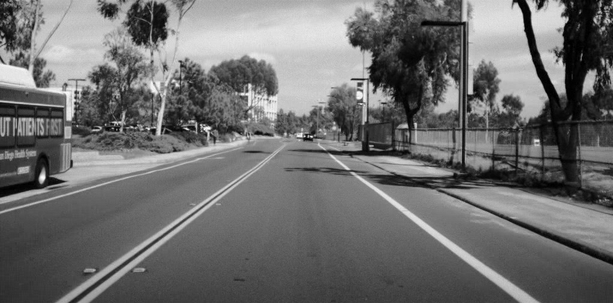
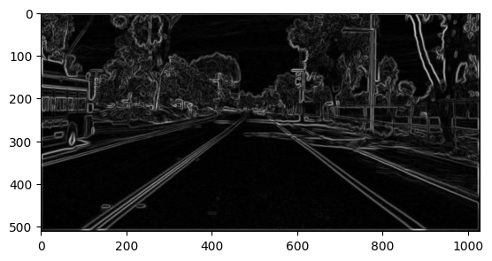
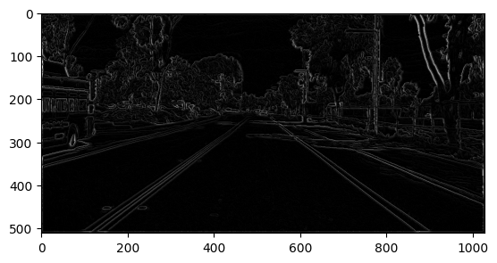
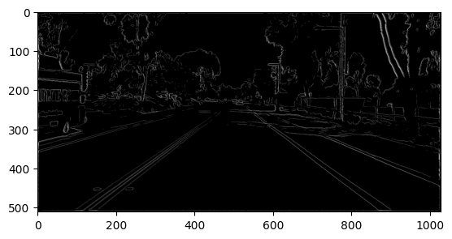

# Canny Edge Detector

In this project I develop the canny edge detector algorithm to extract lane information from lane.png. 

### Original Image:

### Image After Smoothing and Gradient Magnitude Computation:

### Image After Non-Maximum Suppression:

### Image After Thresholding:
