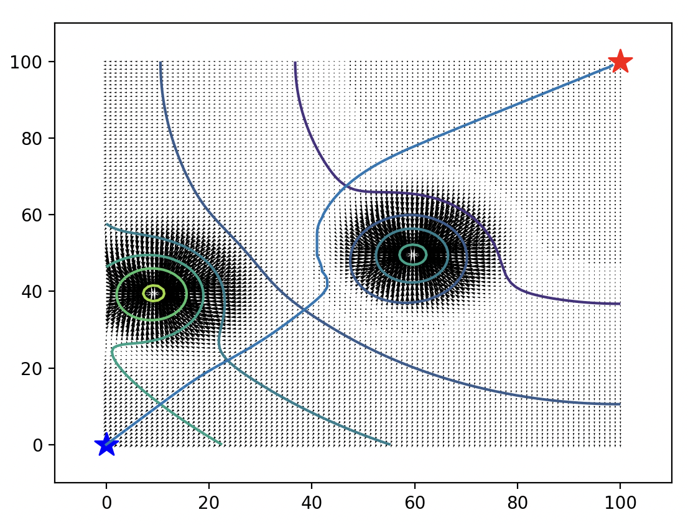
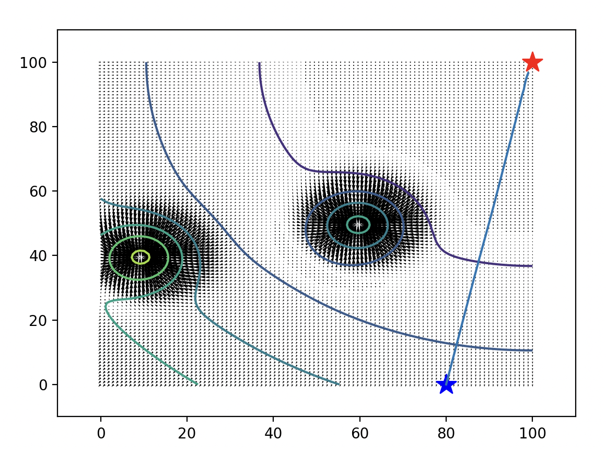
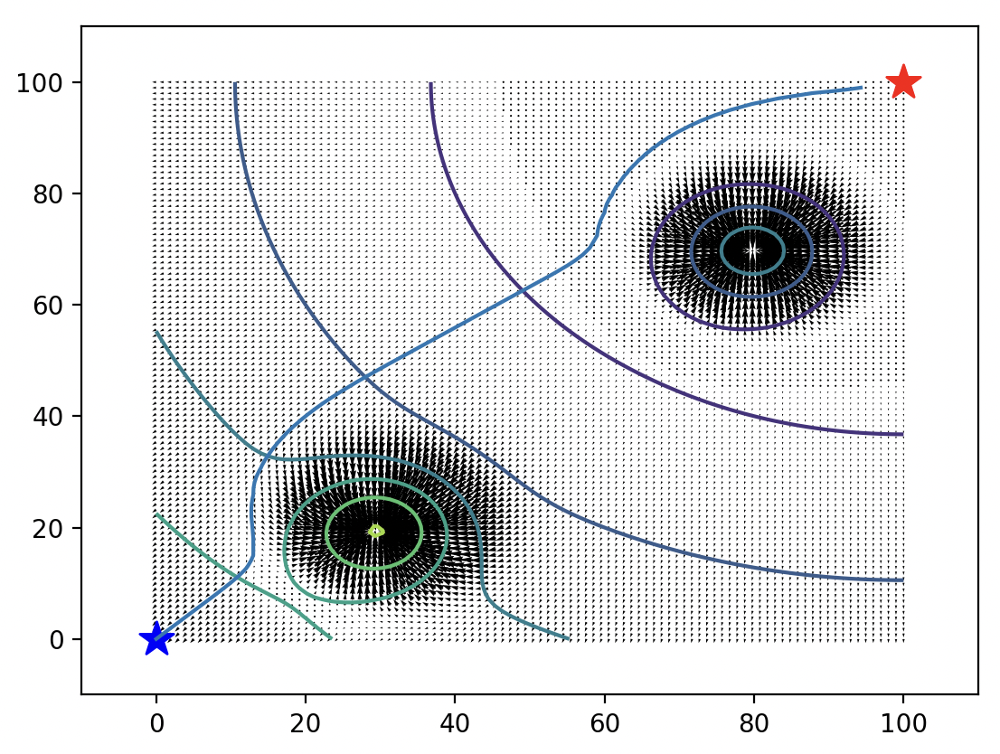

# Better Robot Traversal

In this project, I navigated a robot across a potential field from the starting point (blue star) to the end position (red star) by implementing the gradient descent algorithm.
## 1.1: Plotting the Potential Field

### Part i  

### Part ii

### Part iii

- The obstacles in the room are at (60, 50) and (10, 40)
- The obstacles in the room are represented as repulsors in the potential field, this is because when we implement gradient descent we can avoid these obstacles in our pathfinding solution.
- The gradient starts to decrease and eventually converge to 0, indicating we've reached the final position.

## 1.2 Gradient Descent

The blue line starting at the blue star represents the path the robot takes, where the goal is to reach the red star.
### Part i

### Part ii

### Part iii

