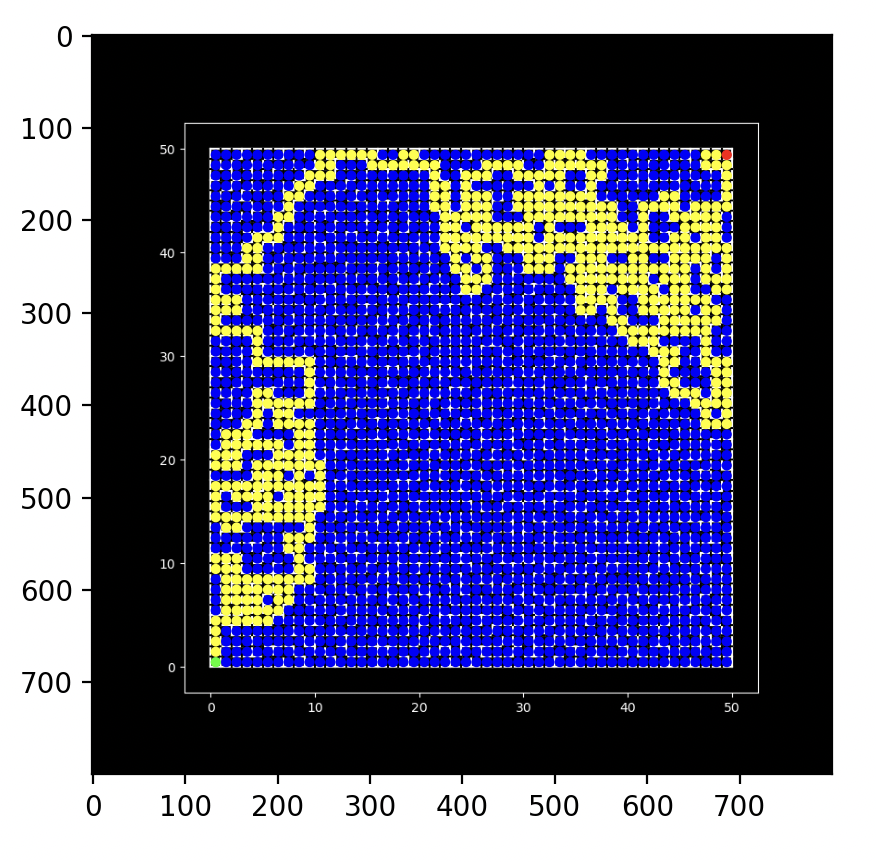
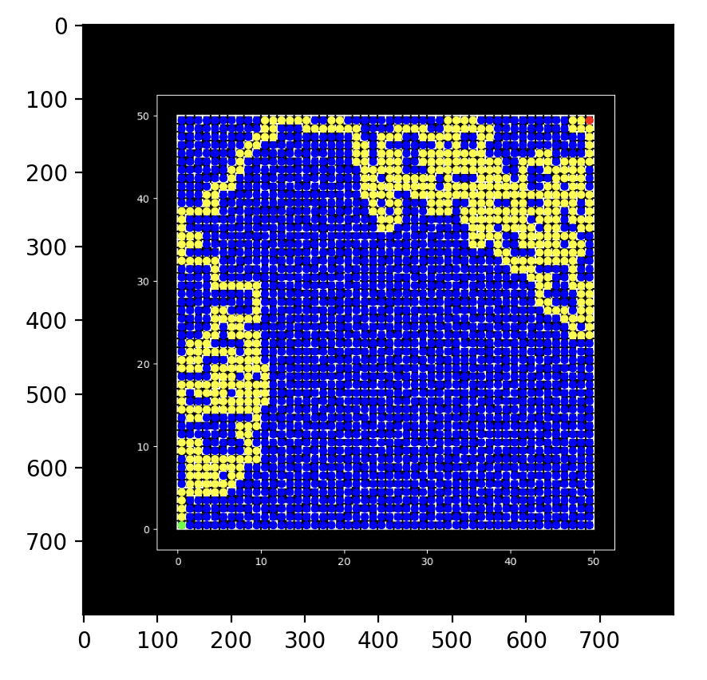

# Maze Pathfinding

In this project, I develop the DFS and BFS algorithms to navigate a maze.

## 4.1 Depth First Search

## 4.2 Breadth First Search

 

- Number of Iterations for BFS: 1263
- Number of Iterations for DFS: 2488

Therefore, the BFS algorithm is better suited for this maze problem.